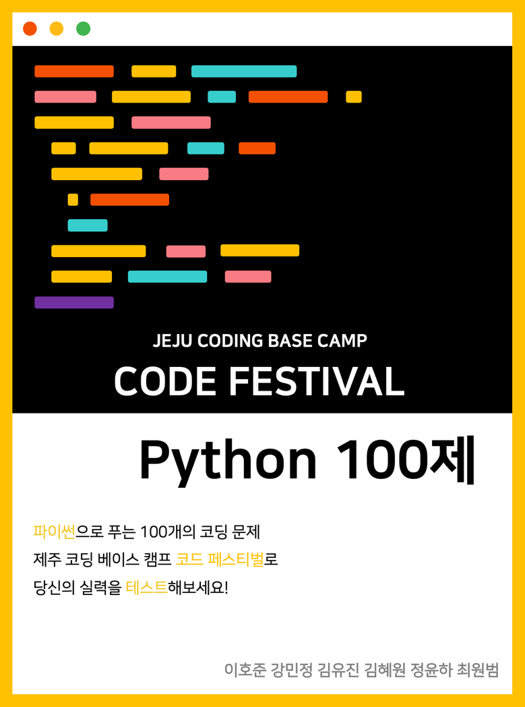

<!-- PROJECT LOGO -->
 

  
  <h3>Python 100</h3>
  <small>제주코딩베이스캠프 Code Festival: Python 100제</small>

## ✅ 공부 일지

<table style="text-align:center;">
    <thead>
        <tr>
            <th width="100%" colspan="10">🏕 Python 100제 1권</th>
        </tr>
    </thead>
    <tbody>
        <tr align="center">
            <td width="10%"><a href="./code/1.py">1번</a></td>
            <td width="10%"><a href="./code/2.py">2번</a></td>
            <td width="10%"><a href="./code/3.py">3번</a></td>
            <td width="10%"><a href="./code/4.py">4번</a></td>
            <td width="10%"><a href="./code/5.py">5번</a></td>
            <td width="10%"><a href="./code/6.py">6번</a></td>
            <td width="10%"><a href="./code/7.py">7번</a></td>
            <td width="10%"><a href="./code/8.py">8번</a></td>
            <td width="10%"><a href="./code/9.py">9번</a></td>
            <td width="10%"><a href="./code/10.py">10번</a></td>
        </tr>
        <tr align="center">
            <td><a href="./code/11.py">11번</a></td>
            <td><a href="./code/12.py">12번</a></td>
            <td><a href="./code/13.py">13번</a></td>
            <td><a href="./code/14.py">14번</a></td>
            <td><a href="./code/15.py">15번</a></td>
            <td><a href="./code/16.py">16번</a></td>
            <td><a href="./code/17.py">17번</a></td>
            <td><a href="./code/18.py">18번</a></td>
            <td><a href="./code/19.py">19번</a></td>
            <td><a href="./code/20.py">20번</a></td>
        </tr>
        <tr align="center">
            <td><a href="./code/21.py">21번</a></td>
            <td><a href="./code/22.py">22번</a></td>
            <td><a href="./code/23.py">23번</a></td>
            <td><a href="./code/24.py">24번</a></td>
            <td><a href="./code/25.py">25번</a></td>
            <td><a href="./code/26.py">26번</a></td>
            <td><a href="./code/27.py">27번</a></td>
            <td><a href="./code/28.py">28번</a></td>
            <td><a href="./code/29.py">29번</a></td>
            <td><a href="./code/30.py">30번</a></td>
        </tr>
        <tr align="center">
            <td><a href="./code/31.py">31번</a></td>
            <td><a href="./code/32.py">32번</a></td>
            <td><a href="./code/33.py">33번</a></td>
            <td><a href="./code/34.py">34번</a></td>
            <td><a href="./code/35.py">35번</a></td>
            <td><a href="./code/36.py">36번</a></td>
            <td><a href="./code/37.py">37번</a></td>
            <td><a href="./code/38.py">38번</a></td>
            <td><a href="./code/39.py">39번</a></td>
            <td><a href="./code/40.py">40번</a></td>
        </tr>
        <tr align="center">
            <td><a href="./code/41.py">41번</a></td>
            <td><a href="./code/42.py">42번</a></td>
            <td><a href="./code/43.py">43번</a></td>
            <td><a href="./code/44.py">44번</a></td>
            <td><a href="./code/45.py">45번</a></td>
            <td><a href="./code/46.py">46번</a></td>
            <td><a href="./code/47.py">47번</a></td>
            <td><a href="./code/48.py">48번</a></td>
            <td><a href="./code/49.py">49번</a></td>
            <td><a href="./code/50.py">50번</a></td>
        </tr>
    </tbody>
    <thead>
        <tr>
            <th width="100%" colspan="10">🏕 Python 100제 2권</th>
        </tr>
    </thead>
    <tbody>
        <tr align="center">
            <td><a>51번</a></td>
            <td><a>52번</a></td>
            <td><a>53번</a></td>
            <td><a>54번</a></td>
            <td><a>55번</a></td>
            <td><a>56번</a></td>
            <td><a>57번</a></td>
            <td><a>58번</a></td>
            <td><a>59번</a></td>
            <td><a>60번</a></td>
        </tr>
        <tr align="center">
            <td><a>61번</a></td>
            <td><a>62번</a></td>
            <td><a>63번</a></td>
            <td><a>64번</a></td>
            <td><a>65번</a></td>
            <td><a>66번</a></td>
            <td><a>67번</a></td>
            <td><a>68번</a></td>
            <td><a>69번</a></td>
            <td><a>70번</a></td>
        </tr>
        <tr align="center">
            <td><a>71번</a></td>
            <td><a>72번</a></td>
            <td><a>73번</a></td>
            <td><a>74번</a></td>
            <td><a>75번</a></td>
            <td><a>76번</a></td>
            <td><a>77번</a></td>
            <td><a>78번</a></td>
            <td><a>79번</a></td>
            <td><a>80번</a></td>
        </tr>
        <tr align="center">
            <td><a>81번</a></td>
            <td><a>82번</a></td>
            <td><a>83번</a></td>
            <td><a>84번</a></td>
            <td><a>85번</a></td>
            <td><a>86번</a></td>
            <td><a>87번</a></td>
            <td><a>88번</a></td>
            <td><a>89번</a></td>
            <td><a>90번</a></td>
        </tr>
        <tr align="center">
            <td><a>91번</a></td>
            <td><a>92번</a></td>
            <td><a>93번</a></td>
            <td><a>94번</a></td>
            <td><a>95번</a></td>
            <td><a>96번</a></td>
            <td><a>97번</a></td>
            <td><a>98번</a></td>
            <td><a>99번</a></td>
            <td><a>100번</a></td>
        </tr>
    </tbody>
</table>
